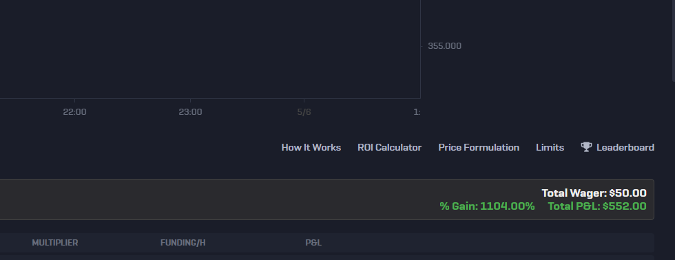

# Rollbit Summarizer Chrome Extension (v1.0.0)
A simple Chrome extension that enhances your Rollbit trading experience by displaying a summary of your active bets, including total wager, total P&L (Profit & Loss), and the percentage gain. The summary updates automatically every minute.
## Features
* **Total Wager:** Calculates and displays the sum of all wagers in your active bets table.
* **Total P&L:** Calculates and displays the sum of the Profit & Loss for all your active bets.
* **Percentage Gain:** Shows the overall percentage gain based on the Total P&L relative to the Total Wager.
* **Automatic Updates:** The summary box refreshes every 2 seconds to reflect changes in your P&L.
## How to Install (from source/GitHub)
Since this extension is not yet on the Chrome Web Store (or if you prefer to install from source):
1.  **Download:**
    * Click the green "Code" button on this GitHub repository page.
    * Select "Download ZIP".
    * Unzip the downloaded file to a folder on your computer.
    *(Alternatively, you can clone the repository if you have Git installed: `git clone [https://github.com/stonkzzyy/Stonkz-rollbit-summarizer]`*

2.  **Open Chrome Extensions:**
    * Open Google Chrome.
    * Type `chrome://extensions` in the address bar and press Enter.
3.  **Enable Developer Mode:**
    * In the top-right corner of the Extensions page, find the "Developer mode" toggle and switch it **ON**.
4.  **Load Unpacked Extension:**
    * Click the "Load unpacked" button that appears.
    * Navigate to the folder where you unzipped or cloned the extension files.
    * Select the folder that directly contains the `manifest.json` file (e.g., `rollbit-extension-v1` or the name you gave your project folder).
    * Click "Select Folder".
The "Rollbit Summarizer" extension should now appear in your list of extensions and be active.
## How to Use
1.  Navigate to a Rollbit trading page where your "Active Bets" table is visible (e.g., `https://rollbit.com/trading/...`).
2.  After a few seconds (initial delay is ~2.5 seconds), a summary box should appear directly above the active bets table.
3.  The box will display:
    * Total Wager
    * % Gain (on the left of the second line)
    * Total P&L (on the right of the second line, on the same line as % Gain)
4.  The values will automatically update every 2 seconds.
## Screenshots

Troubleshooting

Summary box not appearing?
Ensure you are on a Rollbit page with an active bets table that has "WAGER" and "P&L" columns in its header.
Double-check that the extension is enabled in chrome://extensions.
Try reloading the Rollbit page (Ctrl+R or Cmd+R).
The selectors used in content.js to find the table (table, thead tr, etc.) might need updating if Rollbit significantly changes its website structure. Check the browser's developer console (F12 -> Console tab) for any errors from "Rollbit Summarizer".
Files in this Repository
manifest.json: The extension manifest file, defining its properties and permissions.
content.js: The core JavaScript file that performs the calculations and DOM manipulation on Rollbit pages.
icons/: This folder should contain your extension icons (icon16.png, icon32.png, icon48.png, icon128.png).
License
This project is licensed under the MIT License 
# stonkz-rollbit-summarizer
A Chrome extension that tracks your total wager, total P&amp;L and %gain on Rollbit
